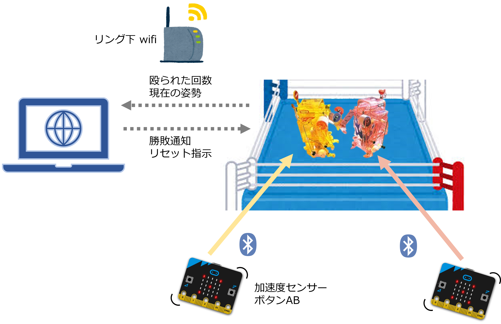

# ボクシングゲーム

TAMIYA 2チャンネルリモコン・ボクシングファイター対戦セットをベースにマイコン M5Atom S3 を利用した対戦ゲーム。
以下の技術を学ぶことができる。

- ESP32 (M5Atom) のプログラミング
- Micro:bit のブロックプログラミングおよび Bluetooth 設定
- Python (PySimpleGUI) のプログラミング
- MQTT を使ったメッセージング
- 加速センサーを使った姿勢感知
- マルチスレッドによる並行プログラミング
- 外部入力による割込み処理 (ESP32)

など

# 遊び方

Micro:bit をコントローラとして、ボクシングマシンを操作し相手を倒す。  
鼻に赤いボタンがあるので、そこにパンチがヒットすると１ポイント。  
３ポイント先取するか、相手をノックダウン (倒す) と、勝利となる。

# プログラミング

## Micro:bit のプログラミング

Makecode サイトにて、ブロックプログラミングを行う。
このとき、右上の歯車から、「プロジェクトの設定」を選び "No Paring Required: Anyone can connect via Bluetooth." を ON にする。

## M5AtomS3 のプログラミング

Arudino IDE からビルド、書き込む。
(注意：ソースコードを示すパスに日本語が含まれているとコンパイルは通るものの、書き込むことができない。)

MQTT ブローカーの IP address, Micro:bit の Bluetooth MAC アドレス, 自分が Player1 / Player2 の設定が必要。

## PC のプログラミング

Python, paho-mqtt, PyGame, PySimpleGUI をインストールする。
特に PySimpleGUI は、Developer License を登録しないと、使用できるもののライセンスに関する警告が常に出るので注意。

# Wifi AP の設定

Wifi の AP は特に外部 (Internet) に接続する必要はない。
PC 上で稼働する MQTT サーバーへ確実に接続するには、無線 / 有線いずれを利用するとしても設定される IP アドレスを固定しておくのがよい。
(IP アドレスが変わって M5AtomS3 の MQTT クライアントから接続できなくなるのを避ける)

# MQTT ブローカー

MQTT メッセージをハンドリングする MQTT ブローカーが必要。

たとえばこちら：https://www.shiftr.io/desktop

# アーキテクチャ

# ゲーム素材について

イメージは「いらすとや」、効果音は「効果音ラボ」・「On-Jin～音人～」の素材を利用しています。感謝！
